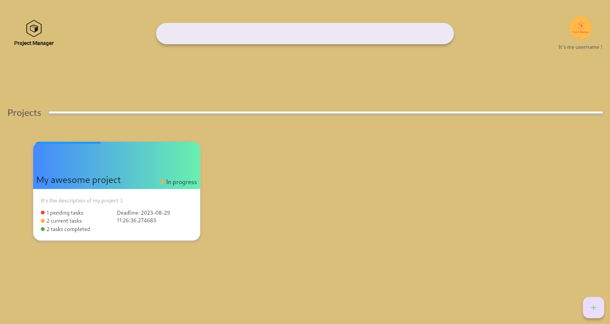
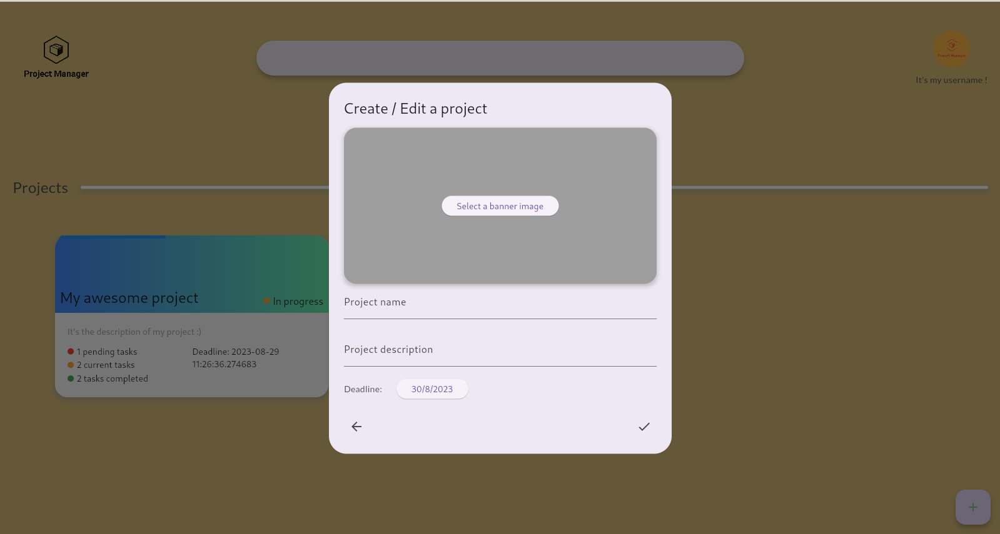
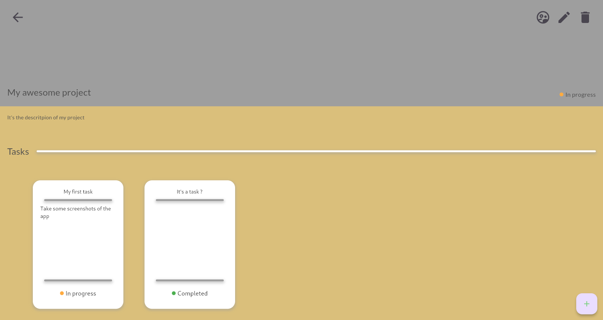

# Project Manager

Project Manager is a Flutter-based application that helps you manage your projects and tasks efficiently. This app provides features such as creating, editing, and deleting projects and tasks, setting deadlines, and tracking progress.

## Features

- Create, edit, and delete projects
- Manage tasks within projects
- Set deadlines for projects and tasks
- Track progress with visual indicators

## Screenshots

## Installation

## License
This project is licensed under the MIT License - see the [LICENSE](license.md) file for details.
